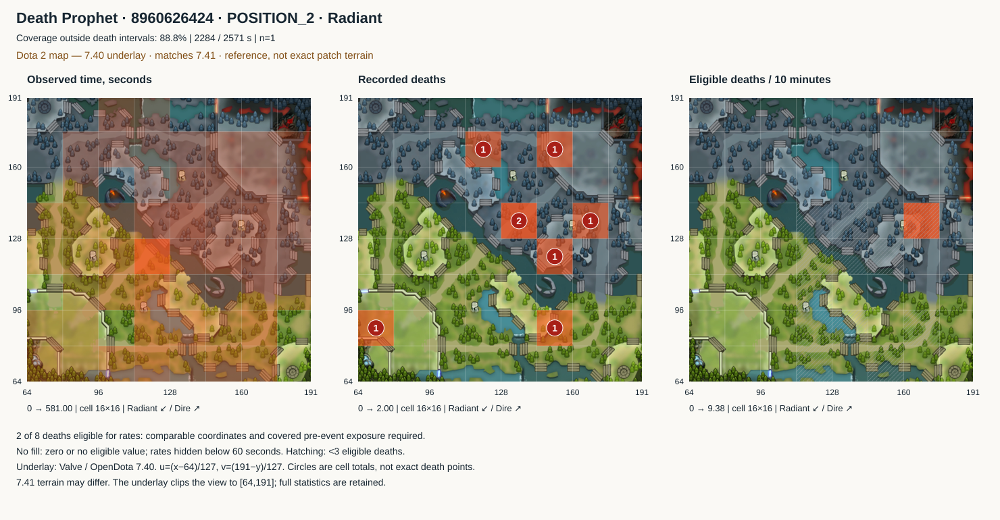
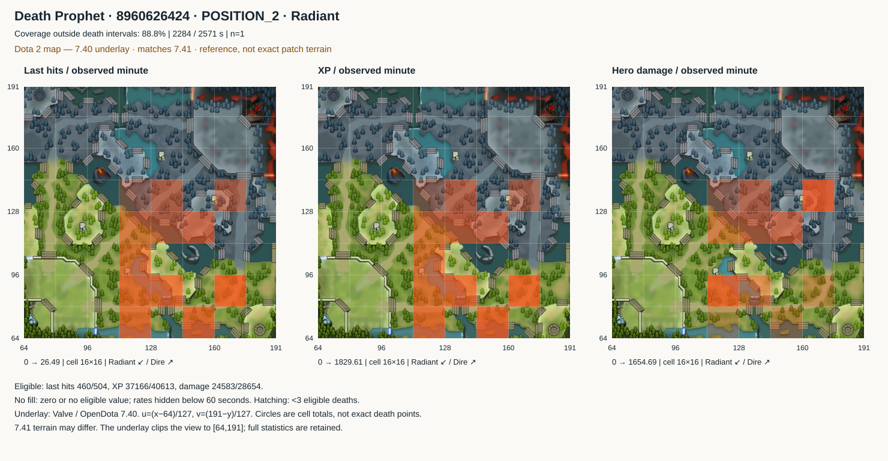
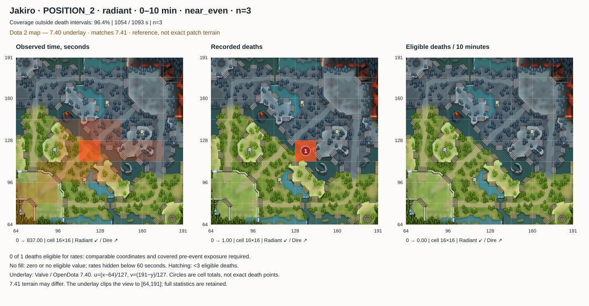

# Spatial statistics and heatmaps

[Development](README.md) · [Numeric L1–L4](numeric-analysis.md) · [Русский](../../ru/development/spatial-analysis.md)

Task 6 is implemented in `src/apps/analysis/spatial/`. The ten saved matches now produce observed occupancy, last-hit, XP, gold, damage, kill, assist and death distributions, cell transitions, and comparisons of observed routes. No new matches or sources were fetched; meta remains disabled. These are numeric inputs to the future profile, not a standalone assessment of playing style.

## Game-map underlay

Heatmaps now overlay a Dota 2 map image with transparent color. The river, lanes and bases provide visual orientation; a death circle is a cell total, not an exact event point. All six SVGs have been rebuilt and embed the image for offline viewing.

The asset is [OpenDota's 7.40 underlay](https://github.com/odota/web/blob/master/src/components/DotaMap/DotaMap.tsx). The matches have OpenDota patch ID 60, corresponding to [7.41](https://github.com/odota/dotaconstants/blob/master/build/patch.json). The image is therefore explicitly labeled **7.40 reference, not exact 7.41 terrain**. Changed objectives and passages must not be validated against it as if it were current terrain.

The projection follows [OpenDota gameCoordToUV](https://github.com/odota/web/blob/master/src/utility.tsx): `u=(x−64)/127`, `v=(191−y)/127`. Matching unambiguous same-type wards within two seconds across providers yielded seven pairs: median difference 1.565, maximum 1.970 source units. Another 82 events had no unambiguous match and were excluded. This supports agreement of observed provider coordinates, not exact terrain alignment. [Results and original-event references](../../../data/prototype/map-calibration.json).

The full `[0,256)` statistical grid and values are unchanged. Only the image displays `[64,191]`; cells extending beyond it are visually clipped without relocating data to the edge. Previously the playable region occupied only part of the plot; the display now uses the underlay's scale. Projection, version and image SHA-256 are recorded in `docs/assets/maps/dota-740.json`.

Offline alignment check:

```powershell
.\.venv\Scripts\python.exe -m tools.check_map_calibration
```

## What the new data provides

**Presence, resource acquisition and participation have different distributions.** In Death Prophet match 8960626424, cell `7,7` accounts for 581 seconds, or 25.4% of observed time outside reported death intervals. However, among cells with ≥60 seconds of exposure, eligible XP intensity peaks in `10,5`: 1829.6 XP per observed minute over 77 seconds. Attributed damage peaks in `10,8`: 1654.7 per minute over 64 seconds. This supports targeted inspection of phases where resource acquisition and damage change location. These rates are not farming efficiency: available creeps and missed opportunities are not the denominator.





**Repetition can be measured without rereading every game.** The Jakiro position 2, Radiant, ranked all pick cohort contains three matches for the first ten minutes, restricted to minutes starting in `near_even` team conditions. Of 1093 seconds outside reported death intervals, 1054 are covered (96.4%); 837 seconds, or 79.4%, fall in `7,7`. This is conditional on role, side and phase, not a whole-match, Dire or support claim. Drill-down identifies matches 8955721990, 8958839199 and 8959040566. The normal packet carries conditions and numbers; the match list is separate.



**Death counts are not area danger.** Death Prophet has two recorded deaths in `8,8`, neither eligible for comparable pre-event exposure. Cell `10,8` has one eligible death over 64 seconds: a computable rate of 9.375 per ten observed minutes with a very small numerator. Hatching marks that limitation. Only **22 of 56 deaths** across the sample qualify for rates. Zero eligible deaths does not establish safety either.

**Route changes can be measured without guessing intent.** For Death Prophet's death at 10:01, the 60-second windows before death and after its reported end contain 60 and 59 covered seconds; total variation between cell-time distributions is 0.749. After the death at 48:12, only 10 of 60 seconds are covered, so its value of 0.911 is not equally reliable. Zero means identical shares; one means disjoint distributions. This measures location change, not the causal effect of death on decisions.

## Coordinate audit

The source is STRATZ `playerUpdatePositionEvents` for all 100 participants. The target player's median step is one second in every match; maximum post-start gaps range from 15 to 105 seconds. Initial Radiant positions appear around `(74,74)`, Dire around `(182,176)`. This verifies side differences within the saved observations, not world scale or base boundaries.

World units and precise semantic region boundaries remain **unverified**. Visual orientation now uses the explicitly versioned OpenDota reference underlay described above. The analysis uses a reproducible source grid: `[0,256) × [0,256)`, cell size 16, zero-based indices, x right and y up. Cell `7,7`, for example, covers `[112,128) × [112,128)`. The frame is an analysis choice, not a verified Dota map boundary. Out-of-frame points remain unknown and are not clamped. Dire is not mirrored or pooled with Radiant.

All ten matches have STRATZ `gameVersionId=182` and OpenDota patch ID=60. These IDs belong to different namespaces. Mixing STRATZ versions, grid parameters or accounts is rejected; unknown versions cannot merge across matches. Matching versions permit native-grid comparisons, not a claim about terrain geometry. Enemy jungle, high ground, effective vision and territory control remain `unavailable`.

Event coordinates often are not hero coordinates. Among pairs with fresh player positions, 54/54 deaths matched exactly, versus 9/92 kills and 4/164 assists. Two other deaths lacked a fresh pair. Therefore last hits, XP, gold, kills, assists and damage use the latest **player** position at age ≤5 seconds, not the event's direct location. Deaths use their direct coordinates; a contradiction with an available fresh player position makes location unknown. Agreement within one provider is not independent replay verification.

## Time, quality and denominators

- Between two valid points at most five seconds apart, elapsed time belongs to the left point's cell. This is a bounded-step estimate, not path reconstruction. Longer intervals are entirely unknown; time after the final point is not extrapolated.
- Identical same-time observations collapse. Conflicting same-time coordinates create a break. A malformed row whose timestamp was lost during L1 normalization makes the stream ineligible for placement: silently bridging across it would be unsafe.
- The union of `death.time .. time+timeDead` is separate from time outside those intervals. It is a provider estimate, not verified life status accounting for buybacks and every mechanic. An unavailable death journal yields unknown life status, not alive time.
- A rate event needs an eligible journal, a known location and matching covered exposure outside death. Death uses the instant immediately **before** the event, including the preceding state/phase at a boundary. Other events use their own interval; match-end events enter the final interval once.
- Each layer retains total, mapped, unknown and rate-eligible events and values, plus eligible exposure. Ineligible journals add no time to that layer's denominator. Missing journals therefore do not dilute a pooled rate with zero; an observed eligible empty journal remains distinct from missing data.
- Rates pool eligible values / eligible seconds ×60, or ×600 for deaths. Match rates are not averaged without weights. Gold is the signed sum of recorded flows, including negatives; it is neither farming income alone nor final GPM.
- Damage is restricted to the original hero against a known enemy hero, without illusions and with `fromNpc=0`. Location belongs to the attacker. This is an available participation component, not reconstruction of complete teamfights.
- Nearest-ally distance is sampled every five seconds only with fresh coordinates for all four allies and covered target presence. Units are native. It measures distance to the closest **observed position**, not established isolation: ally life state and availability to help are not reconstructed.

SVG transparent color intensity scales independently within each panel; scales appear below and cell tooltips contain values. No fill means zero or no eligible value, not established safety. Rate values are hidden below 60 seconds of eligible exposure; death cells are additionally hatched below three eligible events. These thresholds are not significance tests. Small denominators remain in JSON with flags.

## Levels and accumulation

| Level | Stored result | On-demand detail |
| --- | --- | --- |
| L1 | Verified facts from the existing numeric pipeline | Original file, SHA-256, JSON pointer |
| L2 | Disjoint intervals, located events, unknown locations, transitions, audit and ally distances | Sequences and event placement |
| L3 | Additive distributions by ten-minute phase and each minute's initial team state | Cells, numerators/denominators, transitions |
| L4 | Match distribution, coverage, top presence cells, metrics and context | Full grid and action routes |
| L5 | Separate hero × position × mode × side × phase × state groups | Group map and contributing match list |

`ahead/behind/near_even` uses team net-worth difference at the beginning of each minute, thresholds ±1000, and fresh snapshots for every player. Otherwise state is `unknown`. This is an observation condition, not final outcome or causal control. L4 preserves lane and both drafts from numeric L1; automatic draft comparisons are outside this task.

Time, event values/counts, transition counts and distance count/sum/sum-of-squares are additive. Local references and unique match IDs support provenance checks. Duplicate matches, mismatched child revisions and incompatible versions are rejected. Combining saved spatial summaries does not require original coordinates. Persistent accumulation, corrected-match replacement and the “1000+10” algorithm belong to task 8.

`L5-compact.json` is bounded at **32,000 bytes**. It carries conditions, measurements, coverage and distribution references, without coordinate sequences or match lists. Groups are ordered by observed time; omitted contexts are counted explicitly and can be requested with filters. The current sample has 68 groups, of which 14 fit the normal packet. This is a transport limit, not selection of statistically significant patterns.

`enriched.json` combines numeric L4 with spatial features, replacing spatial placeholders in a separate view. Original task 5 outputs are retained. Spatial files use `spatial-analysis-1`; parameters, implementation code and input revisions enter the build key. Manifests record sizes and SHA-256, and reading L4 validates the spatial L3/L2 chain. Building also verifies original snapshots and the numeric chain; standalone spatial reads do not reread original sources.

## Commands

Run from the repository root with the saved local snapshots present. Large original JSON may be absent after cloning: commands fail explicitly instead of fetching more data.

```powershell
# All ten matches, bounded analyst packet
.\.venv\Scripts\python.exe -m src.apps.analysis.spatial.cli --all --compact --output data/analysis/spatial/L5-compact.json

# Presence and deaths for one match; JSON keeps phases/states separate
.\.venv\Scripts\python.exe -m src.apps.analysis.spatial.cli --match-id 8960626424 --svg data/analysis/spatial/presence.svg

# Last hits, XP and attributed damage
.\.venv\Scripts\python.exe -m src.apps.analysis.spatial.cli --match-id 8960626424 --resources --svg data/analysis/spatial/resources.svg

# Comparable cohort; phase is its starting time in seconds
.\.venv\Scripts\python.exe -m src.apps.analysis.spatial.cli --all --hero-id 64 --position POSITION_2 --side radiant --phase 0 --state near_even --svg data/analysis/spatial/jakiro.svg

# First recorded death: before death versus after its reported end
.\.venv\Scripts\python.exe -m src.apps.analysis.spatial.cli --match-id 8960626424 --route-kind death --source-index 0 --output data/analysis/spatial/route.json

# Real-data checks and reproducible RU/EN examples
.\.venv\Scripts\python.exe -m tools.check_spatial_analysis
.\.venv\Scripts\python.exe -m unittest tools.test_spatial_analysis tools.test_numeric_analysis tools.test_analysis tools.test_analysis_series tools.test_synthesis
```

Callable services: `build_spatial_match`, `aggregate_selection`, `compact_selection`, `route_for_action`, `render_maps`. Routes support death/purchase/ability/item/kill with an original source index. Pregame actions outside the route time frame are rejected; a death's post-action window starts at its reported end. Default window: 60 seconds, maximum 300. Returned sequences have a record limit and explicit omitted counts; distribution comparison uses the entire window. Gaps break paths; teleportation and walkability are not inferred. CLI SVG output requires a single unfiltered match or exactly one selected group to avoid accidental context pooling.

## Verification and sensitivity

Machine-readable results: [spatial-verification.json](../../../data/prototype/spatial-verification.json). Checks cover original hashes, 59 addressed source events, independent integer-second/event sums, additivity, deterministic rebuilds and stored dependency chains. RU/EN SVGs were rendered locally to inspect labels and legends. **55 tests pass:** 19 spatial tests plus 36 existing tests, including projection, embedded underlay and explicit version labeling.

| Match | Hero / position / side | Coverage outside death | Rate-eligible / total deaths | Maximum gap, s |
| --- | --- | ---: | ---: | ---: |
| 8960626424 | Death Prophet / 2 / R | 88.8% | 2 / 8 | 105 |
| 8959457705 | Jakiro / 5 / D | 95.2% | 2 / 10 | 83 |
| 8959269261 | Dragon Knight / 2 / D | 80.4% | 3 / 5 | 80 |
| 8959040566 | Jakiro / 2 / R | 94.6% | 3 / 3 | 35 |
| 8958839199 | Jakiro / 2 / R | 95.1% | 2 / 6 | 66 |
| 8957931610 | Night Stalker / 2 / R | 89.6% | 0 / 0 | 15 |
| 8957583110 | Underlord / 3 / R | 86.0% | 3 / 5 | 80 |
| 8957325148 | Jakiro / 2 / D | 93.5% | 3 / 6 | 96 |
| 8956189348 | Juggernaut / 1 / D | 84.6% | 0 / 2 | 71 |
| 8955721990 | Jakiro / 2 / R | 94.0% | 4 / 11 | 86 |

For Death Prophet, a 2/5/10-second gap threshold changes coverage from 72.6% to 88.8% to 94.8%, while the leading cell `7,7` retains 25.7% / 25.4% / 25.4% of observed time. This is sensitivity evidence for **one** observation, not universal method validation. Cell sizes 8/16/32 produce 149/55/19 visited cells while retaining the same 2284 seconds; region counts must not be compared across grids. Tests also cover boundaries, duplicates, conflicting/missing points, stale events, estimated death status, route gaps, side contexts, empty versus missing journals, altered dependencies and the upper-packet budget.

Next come longitudinal and conditional relationships (7), persistent accumulation (8), and L5–L6 profile interpretation (9). These maps do not establish psychological traits, movement mistakes or causal links to winning.
