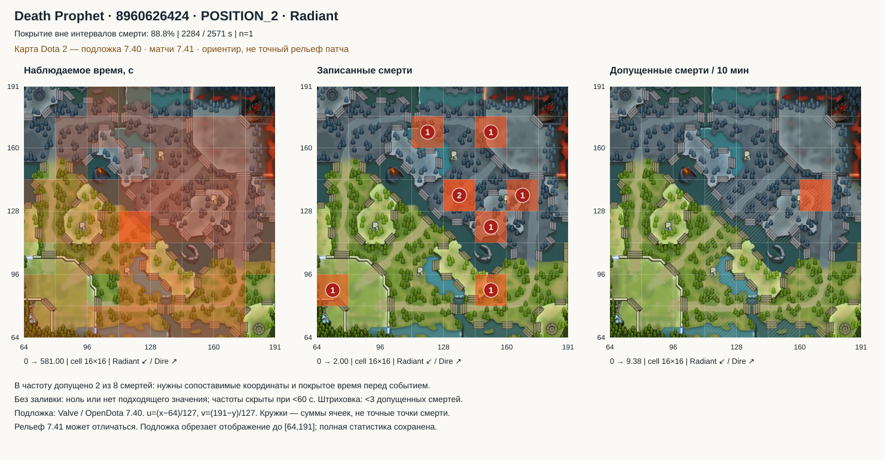
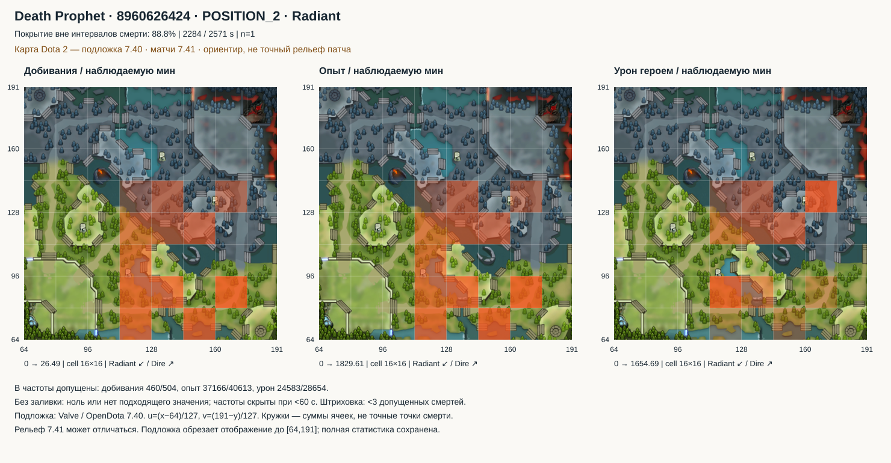
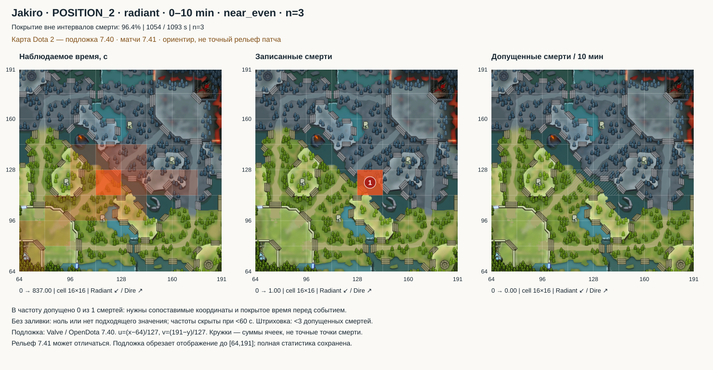

# Пространственная статистика и тепловые карты

[Разработка](README.md) · [Числовые L1–L4](numeric-analysis.md) · [English](../../en/development/spatial-analysis.md)

Задача 6 реализована в `src/apps/analysis/spatial/`. На десяти уже сохранённых матчах рассчитываются время присутствия, распределения добиваний, XP, золота, нанесённого урона, убийств, участий и смертей, переходы между ячейками и сравнения наблюдаемых маршрутов. Новые матчи и источники не загружались; мета отключена. Это числовые входы будущего профиля, а не самостоятельный диагноз стиля игры.

## Подложка игровой карты

Тепловые карты теперь накладываются на изображение Dota 2 с прозрачной заливкой. Река, линии и базы служат визуальными ориентирами; кружок смерти показывает сумму внутри ячейки, а не точную точку события. Все шесть SVG пересозданы, изображение встроено внутрь каждого файла и работает без сети.

Использована [подложка OpenDota 7.40](https://github.com/odota/web/blob/master/src/components/DotaMap/DotaMap.tsx). Матчи имеют OpenDota patch ID 60, то есть [7.41](https://github.com/odota/dotaconstants/blob/master/build/patch.json). Поэтому подложка явно помечена как **ориентир 7.40, не точный рельеф 7.41**. Изменённые объекты и проходы нельзя проверять по ней как по актуальной карте.

Преобразование взято из [OpenDota gameCoordToUV](https://github.com/odota/web/blob/master/src/utility.tsx): `u=(x−64)/127`, `v=(191−y)/127`. Сверка однозначных вардов одинакового типа в пределах двух секунд между источниками дала 7 пар: медианное расхождение 1,565, максимальное 1,970 единицы. Ещё 82 события не получили однозначной пары и не включены в проверку. Это подтверждает близость наблюдаемых координат источников, но не точность всех деталей подложки. [Результат и ссылки на исходные события](../../../data/prototype/map-calibration.json).

Полная статистическая сетка `[0,256)` и значения не изменены. Только изображение показывает область `[64,191]`; выходящие за неё части ячеек обрезаны визуально, без переноса данных на границу. Раньше игровая область занимала лишь часть графика; теперь масштаб соответствует подложке. Проекция, версия и SHA-256 изображения сохранены в `docs/assets/maps/dota-740.json`.

Проверка привязки без сети:

```powershell
.\.venv\Scripts\python.exe -m tools.check_map_calibration
```

## Что дают новые данные

**Частое присутствие, получение ресурсов и участие — разные распределения.** На Death Prophet в матче 8960626424 ячейка `7,7` занимает 581 с, или 25,4% наблюдаемого времени вне записанных интервалов смерти. Однако максимум нормированного XP среди ячеек с ≥60 с покрытия находится в `10,5`: 1829,6 XP за наблюдаемую минуту при 77 с экспозиции. Максимум атрибутированного урона — в `10,8`: 1654,7 за минуту при 64 с. Можно адресно проверить, в каких этапах ты переключаешься между получением ресурсов и нанесением урона. Эти интенсивности не измеряют эффективность фарма: нет знаменателя из доступных крипов и упущенных возможностей.





**Повторяемость можно считать без повторного чтения каждой игры.** Для Jakiro, позиции 2, Radiant, ranked all pick, первых 10 минут и минут с начальным состоянием команды `near_even`, собраны три матча. Из 1093 с вне записанных интервалов смерти покрыты 1054 с (96,4%); 837 с, или 79,4%, приходится на `7,7`. Это условное распределение при конкретной роли, стороне и этапе; оно не обобщается на весь матч, Dire или поддержку. В деталях этого примера доступны матчи 8955721990, 8958839199, 8959040566. Основной пакет содержит условия и числа, а список матчей раскрывается отдельно.



**Число смертей не равно опасности места.** У Death Prophet в `8,8` записаны две смерти, но обе не прошли привязку к сопоставимому времени перед событием. В `10,8` допущена одна смерть на 64 с; вычислимая частота 9,375 на 10 наблюдаемых минут имеет крайне малый числитель. Она отмечена штриховкой, а не объявлена устойчивой особенностью игрока. Во всей выборке для частот допустимы только **22 из 56 смертей**. Нулевое число допущенных смертей также не означает безопасность.

**Изменение маршрута можно измерить, не угадывая намерение.** Для смерти Death Prophet на 10:01 сравнение 60 с перед смертью и 60 с после записанного конца смерти имеет 60 и 59 с покрытия; расстояние между распределениями времени по ячейкам равно 0,749. Для смерти на 48:12 после возвращения покрыты лишь 10 с из 60: значение 0,911 нельзя считать столь же надёжным. Значение 0 означает одинаковые доли, 1 — непересекающиеся распределения. Это изменение местоположения, а не доказательство влияния смерти на решение.

## Проверка координат

Источник — STRATZ `playerUpdatePositionEvents` всех 100 участников. Медианный шаг целевого игрока во всех матчах — 1 с; максимальные послестартовые пропуски — 15–105 с. Начальные точки Radiant наблюдаются около `(74,74)`, Dire — около `(182,176)`. Это проверка различия сторон в сохранённых данных, а не доказательство мирового масштаба или границ баз.

Мировые единицы и точные границы игровых областей **не установлены**. Для визуальной ориентации теперь применяется явно версионированная подложка OpenDota, описанная выше. Принята только воспроизводимая сетка источника: рамка `[0,256) × [0,256)`, размер ячейки 16, индекс от нуля, `x` направо, `y` вверх. Например, `7,7` — `[112,128) × [112,128)`. Рамка — выбор анализа, не подтверждённые границы карты Dota. Выход за неё остаётся неизвестным, координаты не обрезаются. Dire не отражается и не объединяется с Radiant.

Во всех десяти матчах STRATZ `gameVersionId=182`, OpenDota patch ID=60. Это разные пространства идентификаторов. Смешение разных STRATZ-версий, параметров сетки или аккаунтов отклоняется; неизвестная версия не объединяется между матчами. Совпадающая версия позволяет сравнивать нативную сетку, но не доказывает геометрию местности. Названия «вражеский лес», «хайграунд», фактическая видимость и контроль территории остаются `unavailable`.

Координаты события часто не являются координатами героя. Из пар со свежей позицией игрока точно совпали 54/54 смерти, но только 9/92 убийства и 4/164 участия. У ещё двух смертей свежей пары нет. Поэтому добивания, XP, золото, убийства, участия и урон привязываются к последней позиции **игрока** возрастом ≤5 с; прямые координаты этих событий не подменяют её. Смерти используют прямую координату; противоречие с доступной свежей позицией делает местоположение неизвестным. Совпадение внутри одного источника не является независимой проверкой реплеем.

## Время, качество и знаменатели

- Между двумя корректными точками с разницей ≤5 с время относится к ячейке левой точки. Это ступенчатая оценка с ограниченным временным шагом, без восстановления пути между точками. Длинный интервал целиком неизвестен. После последней точки время не достраивается.
- Совпадающие записи одного времени схлопываются. Разные координаты в одно время создают разрыв. Некорректная запись, потерявшая время при нормализации L1, делает поток непригодным для привязки: нельзя незаметно соединять точки через неё.
- Союз интервалов `death.time .. time+timeDead` отделён от времени вне этих интервалов. Это оценка источника, не подтверждённая жизнь/смерть с учётом выкупа и всех механик. При неизвестном журнале смерти статус жизни неизвестен; такой интервал не становится «живым».
- Событие допускается в частоту только при пригодном журнале, известной позиции и совпадающем покрытом интервале вне смерти. Для смерти используется момент непосредственно **перед** ней, включая предшествующее состояние/этап на границе. Остальные события относятся к своему интервалу; окончание матча включается в последний интервал один раз.
- Для каждого слоя хранятся все события, привязанные и неизвестные, допущенные числитель и экспозиция. Непригодный журнал не добавляет время к знаменателю соответствующего слоя. Поэтому отсутствие журнала не разбавляет общую частоту нулём; наблюдаемый пустой пригодный журнал отличается от отсутствующего.
- Формула: сумма допущенных значений / сумма подходящих секунд × 60; для смертей ×600. Средние частоты матчей не усредняются без весов. Золото — подписанная сумма записанных потоков, включая отрицательные; это не только фарм и не итоговый GPM.
- Урон ограничен событиями исходного героя по известному вражескому герою без иллюзий и с `fromNpc=0`. Место относится к атакующему герою. Это часть доступного участия, не реконструкция всех командных боёв.
- Ближайший союзник измеряется каждые 5 с только при свежих координатах всех четырёх союзников и покрытом присутствии игрока. Единицы нативные. Это расстояние до ближайшей **наблюдаемой позиции**, а не доказательство одиночества: жизнь союзников и доступность помощи не восстановлены.

В SVG интенсивность прозрачной заливки масштабируется отдельно в каждой панели; шкала указана снизу, значения — в подсказках ячеек. Отсутствие заливки означает ноль либо отсутствие подходящего значения; это не утверждение о безопасности. Карты частот скрывают значения при <60 с подходящего времени; смерти дополнительно заштрихованы при <3 допущенных событиях. Эти пороги не являются проверкой значимости. Малые знаменатели сохраняются в JSON с флагами.

## Уровни и накопление

| Уровень | Что сохраняется | Что раскрывается по запросу |
| --- | --- | --- |
| L1 | Проверенные факты существующего числового конвейера | Исходный файл, SHA-256, JSON pointer |
| L2 | Непересекающиеся интервалы, размещённые события, неизвестные места, переходы, аудит и расстояния до союзников | Последовательности и привязки событий |
| L3 | Аддитивные распределения по десятиминутному этапу и начальному состоянию каждой минуты | Ячейки, числители/знаменатели, переходы |
| L4 | Распределение матча, покрытие, топ присутствия, показатели и контекст | Полная сетка и маршруты действий |
| L5 | Отдельные группы герой × позиция × режим × сторона × этап × состояние | Карта конкретной группы и список её матчей |

Состояние `ahead/behind/near_even` определяется разностью командного net worth на начале минуты, порогом ±1000 и свежими снимками всех участников. Без этих снимков — `unknown`. Это условие наблюдения, не финальный результат матча и не причинный контроль. Контекст L4 сохраняет линию и оба пика из числового L1; автоматическое сравнение составов не входит в эту задачу.

Суммируются время, значения/количество событий, счётчики переходов, число/сумма/сумма квадратов расстояний. Присутствуют локальные ссылки и уникальные ID матчей для проверки происхождения. Дубликаты матча, несовпадающие дочерние ревизии и несовместимые версии отклоняются. Добавление сохранённых пространственных сводок не требует чтения исходных координат; постоянное накопительное хранилище, замена исправленного матча и алгоритм «1000+10» относятся к задаче 8.

`L5-compact.json` ограничен **32 000 байт**: содержит условия, показатели, покрытие и ссылки на распределения, без последовательностей координат и перечня матчей. Группы идут по наблюдаемому времени; непоместившиеся явно указаны и доступны фильтрами. В текущей выборке 68 групп, в обычный пакет вошли 14. Это ограничение транспорта, а не отбор статистически значимых закономерностей.

`enriched.json` объединяет числовой L4 с пространственными признаками и заменяет его пространственные заглушки в отдельном представлении. Исходные результаты задачи 5 сохраняются. Схема пространственных файлов — `spatial-analysis-1`; параметры, код и ревизии входов входят в ключ сборки. Манифест хранит размеры и SHA-256, чтение L4 проверяет цепочку пространственных L3/L2. При сборке проверяются исходные снимки и числовая цепочка; отдельное чтение пространственного файла само по себе не перечитывает оригиналы.

## Команды

Все команды из корня, с уже доступными локальными снимками. После клонирования больших исходных JSON может не быть: тогда команда выдаст ошибку, а не начнёт новый сбор.

```powershell
# Все десять матчей, компактный пакет для аналитика
.\.venv\Scripts\python.exe -m src.apps.analysis.spatial.cli --all --compact --output data/analysis/spatial/L5-compact.json

# Присутствие и смерти одного матча; JSON содержит отдельные этапы/состояния
.\.venv\Scripts\python.exe -m src.apps.analysis.spatial.cli --match-id 8960626424 --svg data/analysis/spatial/presence.svg

# Добивания, XP, атрибутированный урон
.\.venv\Scripts\python.exe -m src.apps.analysis.spatial.cli --match-id 8960626424 --resources --svg data/analysis/spatial/resources.svg

# Сравнимая группа; phase — начало этапа в секундах
.\.venv\Scripts\python.exe -m src.apps.analysis.spatial.cli --all --hero-id 64 --position POSITION_2 --side radiant --phase 0 --state near_even --svg data/analysis/spatial/jakiro.svg

# Первая записанная смерть: окно до неё и после её записанного конца
.\.venv\Scripts\python.exe -m src.apps.analysis.spatial.cli --match-id 8960626424 --route-kind death --source-index 0 --output data/analysis/spatial/route.json

# Реальные проверки и воспроизводимые примеры RU/EN
.\.venv\Scripts\python.exe -m tools.check_spatial_analysis
.\.venv\Scripts\python.exe -m unittest tools.test_spatial_analysis tools.test_numeric_analysis tools.test_analysis tools.test_analysis_series tools.test_synthesis
```

Вызываемые сервисы: `build_spatial_match`, `aggregate_selection`, `compact_selection`, `route_for_action`, `render_maps`. Для маршрута доступны death/purchase/ability/item/kill и исходный индекс события. Предыгровые действия вне временной рамки маршрутов отклоняются; смерть привязывает окно после действия к записанному концу смерти. Окно по умолчанию 60 с, максимум 300; последовательность ограничена числом записей с явным счётчиком опущенных, а сравнение использует всё окно. Пропуски разрывают путь; телепорт и проходимость не угадываются. CLI строит SVG только для одного матча без фильтров или одной выбранной группы, чтобы случайно не смешать условия.

## Проверки и чувствительность

Машиночитаемые результаты: [spatial-verification.json](../../../data/prototype/spatial-verification.json). Проверены исходные хэши, 59 адресных событий, независимые суммы целочисленных секунд/событий, аддитивность, детерминированная пересборка и цепочки сохранённых зависимостей. SVG RU/EN отрисованы локально для проверки подписей и легенд. 19 пространственных тестов и 36 существующих тестов — **55 успешно** (включая проекцию, встроенную подложку и явную версию).

| Матч | Герой / позиция / сторона | Покрытие вне смерти | Смерти для частот / всего | Макс. разрыв, с |
| --- | --- | ---: | ---: | ---: |
| 8960626424 | Death Prophet / 2 / R | 88,8% | 2 / 8 | 105 |
| 8959457705 | Jakiro / 5 / D | 95,2% | 2 / 10 | 83 |
| 8959269261 | Dragon Knight / 2 / D | 80,4% | 3 / 5 | 80 |
| 8959040566 | Jakiro / 2 / R | 94,6% | 3 / 3 | 35 |
| 8958839199 | Jakiro / 2 / R | 95,1% | 2 / 6 | 66 |
| 8957931610 | Night Stalker / 2 / R | 89,6% | 0 / 0 | 15 |
| 8957583110 | Underlord / 3 / R | 86,0% | 3 / 5 | 80 |
| 8957325148 | Jakiro / 2 / D | 93,5% | 3 / 6 | 96 |
| 8956189348 | Juggernaut / 1 / D | 84,6% | 0 / 2 | 71 |
| 8955721990 | Jakiro / 2 / R | 94,0% | 4 / 11 | 86 |

У Death Prophet допустимый шаг 2/5/10 с меняет покрытие 72,6% → 88,8% → 94,8%, но доля лидирующей ячейки `7,7` остаётся 25,7% / 25,4% / 25,4%. Это устойчивость **одного** наблюдения к выбранному порогу, не универсальная валидация метода. Размер ячейки 8/16/32 даёт 149/55/19 посещённых ячеек при одинаковых 2284 с: число областей нельзя сравнивать между разными сетками. Тесты также покрывают границы, дубликаты, конфликтные/пропущенные точки, давность событий, оценку смерти, разрывы маршрута, контексты сторон, пустое против отсутствующего, испорченные зависимости и бюджет верхнего пакета.

Следующие этапы — статистика дистанции и условных связей (7), постоянное накопление (8), интерпретация профиля на L5–L6 (9). Текущие карты не устанавливают психологические свойства, ошибки движения или причинную связь с победами.
